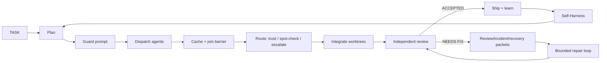

<div align="center">

[](README.md) &nbsp; [](README.zh-CN.md)

# FuguNano

### Open & light-weight reimplementation of Sakana Fugu

### Evidence-gated Evo Engineering for multi-agent software work

<p align="center">
  = 18.18" />
  
  
  
  <a href="https://github.com/BicaMindLabs/FuguNano/actions/workflows/ci.yml"></a>
  
</p>

<p align="center">
  <a href="#quick-start">Quick Start</a> |
  <a href="#how-it-works">How It Works</a> |
  <a href="#verifier-aware-routing">Routing</a> |
  <a href="#command-surface">Commands</a> |
  <a href="docs/WORKFLOW.md">Workflow</a> |
  <a href="docs/SELF_HARNESS.md">Self-Harness</a> |
  <a href="docs/PARITY.md">Parity</a>
</p>


</div>

FuguNano is a small, training-free control plane for multi-agent coding. It does
not train a conductor — it makes the agents you already have work as one
auditable loop: plan, dispatch, gather, review, repair, learn, and improve the
harness itself. Every step is backed by deterministic evidence, not model prose.

## Why FuguNano

| Problem                                         | FuguNano answer                                                     |
| ----------------------------------------------- | ------------------------------------------------------------------- |
| Frontier models or hardware are hard to rely on | Coordinate many available models instead of betting on one path.    |
| Multi-agent outputs are easy to lose            | Every dispatch can write artifacts; every round has a join barrier. |
| Reviews become prose                            | Review, incident, recovery, guard, and handoff packets are typed.   |
| Agent loops spin forever                        | The repair loop is bounded, stateful, and reviewer-gated.           |
| Prompt/runtime safety is invisible              | Guard packets and action certificates create local evidence.        |
| Improvements disappear after one run            | Experience memory and the evolution loop feed lessons back in.      |
| Fan-out output gets trusted blindly             | Selector routes each fan-out: trust a gated pick, spot-check bare consensus, escalate the rest. |

## How It Works

One short pipeline, gated at every hop by the packets below:



The day-to-day path is intentionally short:

```bash
fuguectl preflight --harness lite
fuguectl preflight --harness codex
fuguectl preflight --harness opencode --target opencode/deepseek-v4-flash-free
fuguectl preflight --harness agy
fuguectl preflight --harness fugue-cc

fuguectl task new "implement feature"
fuguectl plan "implement feature" --harness lite --models a,b --out /tmp/fugunano-plan --timeout-ms 120000 --allow-partial --codex-clean --harness-arg x --codex-arg x --opencode-arg x --agy-arg x --task TASK.md
fuguectl guard prompt /tmp/prompt.md --source-ref TASK.md
fuguectl dispatch cc-deepseek --template impl --task TASK.md --task-type backend
fuguectl cache barrier 1
fuguectl route --round 1 --gate ./run-tests.sh   # exit 0 TRUST / 10 SPOT_CHECK / 20 ESCALATE
fuguectl integrate --work /path/to/project --agents "cc-deepseek cc-kimi"
fuguectl review packet /tmp/review.txt --json
fuguectl incident packet /tmp/failure.log --json
fuguectl incident recovery /tmp/failure.log --json
fuguectl loop record --verdict NEEDS_FIX --round 1
fuguectl loop decide
```

`fuguectl smoke --harness all --codex-clean --timeout-ms 120000 --task TASK.md
--out-dir /tmp/fugunano-smoke` writes `summary.json` with
`status`/`passed`/`failed`/`exitCode`.

`fuguectl plan ...` writes `<out>/summary.json` with
`status`/`exitCode`/`allowPartial`/`succeeded`/`available`/`failed`, so planning
can be inspected without reading model chat.

## Quick Start

Requirements: macOS or Linux, Node.js >= 18.18, `git`, `tmux`, and whichever
model credentials you choose to use. Codex is recommended for independent
review.

```bash
git clone https://github.com/BicaMindLabs/FuguNano fugunano
cd fugunano

/path/to/fugunano/orchestration/fuguectl/fuguectl help quickstart
/path/to/fugunano/orchestration/fuguectl/fuguectl init --dry-run
make doctor
make install
make verify
make ci-clean
```

Real keys stay outside the repository:

```bash
mkdir -p ~/.config
$EDITOR ~/.config/cc-model-secrets.env
```

For the optional `fugue-cc` worktree fleet:

```bash
cp orchestration/fugue-cc/provider.config.example /path/to/project/.fugue-cc/provider.config
cd /path/to/project
fugue-cc

/path/to/fugunano/orchestration/fuguectl/fuguectl preflight --harness fugue-cc
/path/to/fugunano/orchestration/fuguectl/fuguectl fleet status
```

Install the operator skill:

```bash
make install-skill
~/.claude/skills/fugunano/fuguectl selftest
```

The skill is convenient for Claude Code, but the workflow is runtime-neutral.
Codex, OpenCode, Antigravity, and future agents use the same agent profiles.
Frontend/UI work may be sent through `agy --prompt "..."`; review should remain
independent.

## Evidence Packets

The loop does not run on prose — it runs on typed packets. Each one is
deterministic TypeScript that gates a hop in the pipeline above and becomes
fuel for the evolution loop below.

| Packet                   | Command                           | Purpose                                               |
| ------------------------ | --------------------------------- | ----------------------------------------------------- |
| Task handoff             | `fuguectl task handoff`           | Give the next agent the contract and recent evidence. |
| Task digest              | `fuguectl task digest`            | Fit long TASK context into a bounded prompt card.     |
| Review packet            | `fuguectl review packet`          | Turn reviewer prose into findings and checks.         |
| Incident packet          | `fuguectl incident packet`        | Label failed traces with cause, layer, and evidence.  |
| Incident recovery packet | `fuguectl incident recovery`      | Emit containment, repair, validation, and learning.   |
| Runtime guard packet     | `fuguectl guard prompt`           | Block risky prompts before runtime dispatch.          |
| Action certificate       | `fuguectl dispatch --certificate` | Record proof for a runtime action.                    |

## Agent Runtime Contract

<p align="center">
  
</p>

The core only knows one `Harness` port (`dispatch(req) → Result`, `health()`), so
adding an agent never touches orchestration. Four core harnesses
(`fugue-cc|codex|opencode|agy`) stay in the default surface; experimental
runtimes are opt-in and excluded from `preflight --all`.

| Tier         | Runtime                                                       | How it plugs in                                                                    |
| ------------ | ------------------------------------------------------------ | --------------------------------------------------------------------------------- |
| Core         | `fugue-cc` · `codex` · `opencode` · `agy`                    | descriptor-backed adapters in the default surface                                 |
| Experimental | `agent-cli` (qwen-code · kimi-code · mimo-code · trae · qoder) | one `InvocationDescriptor` per agent in the registry — no new `HarnessName`        |
| Experimental | `acp-agent`                                                  | a protocol adapter (`initialize → prompt → result`), deliberately not a descriptor |

A new agent is a registry entry plus a preflight probe and a smoke test, not a
core change. Every harness satisfies the same port, so it inherits the guard and
certificate gates for free.

## Verifier-aware Routing

Fanning out to many cheap models is only as good as the check behind it.
`Selector` (`engine/src/domain/selector.ts`) is a pure-domain router that decides
what to do with a best-of-N fan-out: `TRUST` (a verifier vouched for a pick),
`TRUST_SPOT_CHECK` (the fleet agrees but nothing verified it), or `ESCALATE`
(hand off to a premium model). The rules are grounded in a benchmark, not a hunch:

- **With a cheap verifier** (unit tests / a reference solution) best-of-N is
  effectively free — the gate picks the passing candidate. A fleet of small
  models matched premium single models across 100 graded algorithm tasks, and
  again on a harder 14-task set (solo small models passed only ~11/14; the gate
  lifted the ensemble to 14/14, level with the best premium model). On real
  SWE-bench-lite instances the same executable-gate pipeline resolves issues
  end-to-end with no LLM judging anywhere
  ([benchmarks/case-swebench](benchmarks/case-swebench/)).
- **Without one, agreement is the only signal — and it fails _correlated_.** On
  security, impossible-requirement, and subtle-correctness traps the whole fleet
  tends to fall into the same hole, so consensus there is confidently wrong.
  Those categories escalate outright, and unverified consensus is never clean
  `TRUST` — only `TRUST_SPOT_CHECK`. Confidence is Laplace-smoothed so a 5/5
  fleet reads as 0.86, not certainty, and escalations are ordered by
  disagreement so premium budget goes to the least-certain tasks first.
- **A skeptic playbook** ([templates/skeptic.md](orchestration/fuguectl/templates/skeptic.md))
  pre-injects category-level challenge rules distilled from known traps. On a
  held-out set of unseen traps it lifted small-model trap-avoidance from 59% to
  84% with zero regressions — the rules generalize because they target
  categories, not memorized questions.

Each mechanism maps to a specific paper (EDV, Agentic Abstention, OmniOPD,
SkillHarness). The router is verifier-agnostic: it consumes whatever
`verified`/`label` signals a task can cheaply produce, which is exactly the
"verifier ladder" — real gate → synthesized gate → skeptic pass → judge →
consensus → escalate.

The same law caps the review loop itself: on a SWE-bench instance whose
gold-required behavior is not observable from any non-cheating signal
(the issue text itself is ambiguous), single-shot, a blind review-loop, and a
legitimate-signal loop (repro + regression checks) all fail alike.
Orchestration buys you exactly as much as the signals you can observe.

## Evidence-gated Evolution

<p align="center">
  
</p>

FuguNano treats runtime evidence as the start of an engineering loop, not the
end of a report. Packets become weakness signals; candidate edits to engineering
surfaces are scored on fixed held-in/held-out cases; only non-regressing changes
are promoted and written to auditable lineage. Safety surfaces such as
`guard-rule` always require operator promotion — the agent can never quietly
relax its own guardrails.

Dogfood fixture: [.fugunano/evolution/evo-guard-rule-tighten-gh-release-certificate.json](.fugunano/evolution/evo-guard-rule-tighten-gh-release-certificate.json)
records a real guard-rule promotion for a missing action-certificate check.

Self-Harness is the first backend of this loop — it evolves the harness config
surfaces (system prompt, memory, skills, …):

<p align="center">
  
</p>

It mines verifier-grounded failures, proposes bounded edits, and promotes only
non-regressing changes. Read the operator guide in
[docs/SELF_HARNESS.md](docs/SELF_HARNESS.md).

## Command Surface

`orchestration/fuguectl/fuguectl` is the production entry point: 29 subcommands,
30 test suites, and 434 wrapper assertions.

| Area               | Commands                                                                                                                                                                                                                                                                                                                     |
| ------------------ | ---------------------------------------------------------------------------------------------------------------------------------------------------------------------------------------------------------------------------------------------------------------------------------------------------------------------------- |
| Setup              | `fuguectl doctor`, `fuguectl init --dry-run\|--write`, `fuguectl version`, `fuguectl preflight --harness fugue-cc\|codex\|opencode\|agy\|lite\|all`, `fuguectl smoke`, `fuguectl fleet status\|up\|down`                                                                                                                     |
| Planning           | `fuguectl task new\|log\|done\|handoff\|digest`, `fuguectl template <name>`, `fuguectl plan "<goal>" [--harness h\|lite] [--models a,b] [--out dir] [--timeout-ms n] [--allow-partial] [--codex-clean] [--harness-arg x] [--codex-arg x] [--opencode-arg x] [--agy-arg x] [--task f]`, `fuguectl goal template\|show\|check` |
| Routing            | `fuguectl allocate <type>`, `fuguectl route [<file>\|-\|--round n [--gate cmd]] [--category c] [--threshold n] [--forced a,b] [--task f]`, `fuguectl workspace list\|show\|model\|context`, `fuguectl agents template\|validate\|list\|resolve`, `fuguectl skills index\|list\|match\|show\|inject\|validate\|forge`                                            |
| Dispatch           | `fuguectl guard prompt <file\|->`, `fuguectl dispatch <target> [--certificate <file>] [--skeptic]`, `fuguectl cache init\|put\|fail\|barrier\|collect\|resume`                                                                                                                                                                           |
| Review + repair    | `fuguectl integrate --work <repo>`, `fuguectl review packet <file\|->`, `fuguectl incident packet\|recovery <file\|->`, `fuguectl loop init\|record\|decide\|status`, `fuguectl run set\|round\|status\|next\|clear`, `fuguectl summary <round>`                                                                             |
| Memory + evolution | `fuguectl experience add\|audit\|eval\|learn\|list\|policy\|promote\|recall\|show`, `fuguectl evolve mine\|validate\|promote\|history`, `fuguectl self-harness template\|run`, `fuguectl runtime check\|adapt`, `fuguectl selftest`                                                                                          |

## Fugu, OpenFugu, FuguNano

<p align="center">
  
</p>

| System      | Coordination layer              | Best for                                         |
| ----------- | ------------------------------- | ------------------------------------------------ |
| Sakana Fugu | Learned conductor behind an API | Managed multi-model synthesis.                   |
| OpenFugu    | Open training and serving stack | Rebuilding and studying the conductor route.     |
| FuguNano    | Repo-native engineering loop    | Training-free orchestration, review, and repair. |

FuguNano is the lightest open entry point on this road: start with policies,
ports, review gates, evidence packets, and harness improvement before deciding
whether a learned conductor is worth the cost.

## Docs Map

| Need                            | File                                           |
| ------------------------------- | ---------------------------------------------- |
| Agent profiles and runtimes     | [docs/AGENT_RUNTIME.md](docs/AGENT_RUNTIME.md) |
| Full workflow                   | [docs/WORKFLOW.md](docs/WORKFLOW.md)           |
| Architecture and ports/adapters | [docs/ARCHITECTURE.md](docs/ARCHITECTURE.md)   |
| Self-Harness guide              | [docs/SELF_HARNESS.md](docs/SELF_HARNESS.md)   |
| Parity and references           | [docs/PARITY.md](docs/PARITY.md)               |
| Integration notes               | [docs/INTEGRATIONS.md](docs/INTEGRATIONS.md)   |
| Agent-facing contract           | [AGENTS.md](AGENTS.md)                         |

## Development

```bash
npm run scan
npm run lint:launchers
npm run check:docs
npm run test:fuguectl
cd engine && npm run check && npm run build
npm run ci
```

The engine is strict TypeScript with ports and adapters. The repo keeps shell
usage as thin launchers; new durable behavior should live in `engine/`.

## Acknowledgements

FuguNano builds on ideas from Sakana AI Fugu, OpenFugu, Shanghai AI Lab
Self-Harness, Codex/Claude/OpenCode runtime tooling, and recent work on
agent review, provenance, incident response, memory, and prompt safety. See
[NOTICE](NOTICE) and [docs/PARITY.md](docs/PARITY.md) for the reference list.

## Security

Do not commit real keys. Put local secrets in `~/.config/cc-model-secrets.env`.
Report vulnerabilities privately.

## License

Apache-2.0. See [LICENSE](LICENSE).
